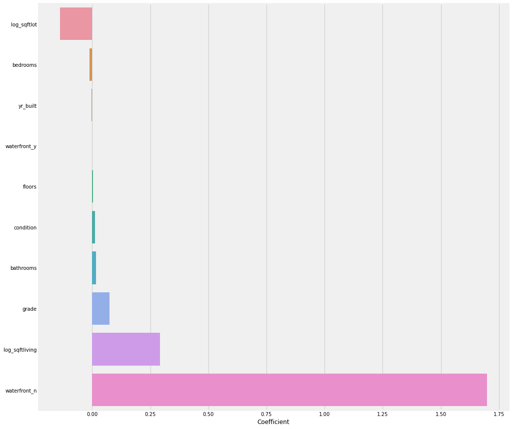
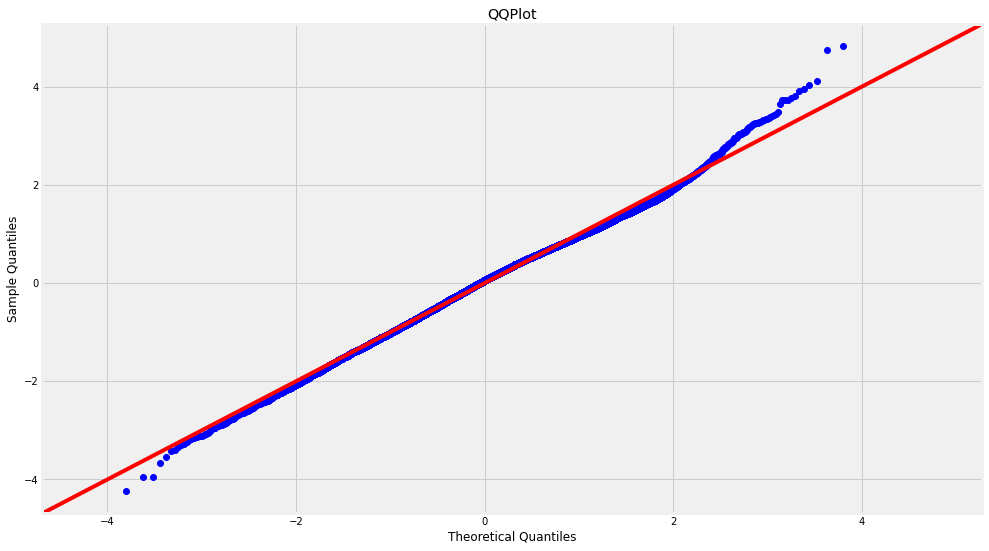

# Homes in King County
## Data for Home Sellers and Renovators 

**Authors**: Justin Hue
.


### Business problem:

We want to give prospective home sellers solid data and confidence as to what will make their homes sell for more money.


### Data:
We were given data by King County in order to structure models for the home owner looking to sell, or simply to evaluate worth. It includes: 

- Price
- Condition
- Square Footage of Living Space and Lot
- Bedrooms/ Bathrooms


## Methods
An iterative linear regression process was used to construct the models. The data provided was used to ensure linearity, remove outliers, and also make sure the data was clear of multicollinear variables. Many of the starting variables were dropped, as they were not entirely necessary to the final model or pricing influence.

## Results


#### 



####



### For further information
Please review the narrative of our analysis in [our jupyter notebook](./index.ipynb) or review our [presentation](./SampleProjectSlides.pdf)

For any additional questions, please contact **justinhccnm@outlook.com


##### Repository Structure:
```

├── README.md               <- The top-level README for reviewers of this project.
├── index.ipynb             <- narrative documentation of analysis in jupyter notebook
├── presentation.pdf        <- pdf version of project presentation
└── images
    └── images               <- both sourced externally and generated from code
└── data
    └── 

```
